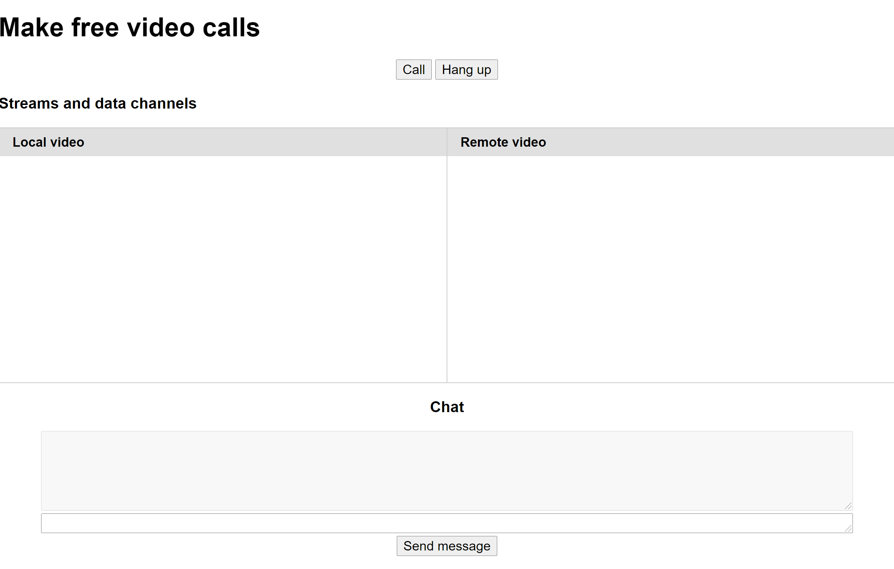
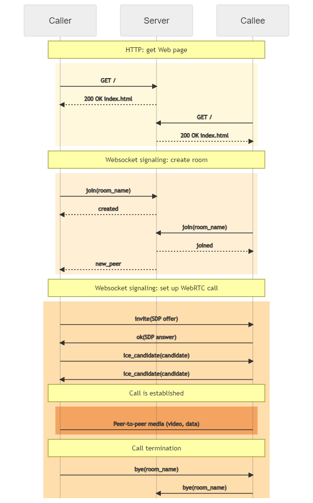

VMM-WebRTC-lab
==============

Student lab to develop a simple but complete video calling application with WebRTC. The frontend is implemented in Javascript with a simple HTML page. The signaling server is implemented in Python with Flask and Flask-SocketIO.

This repository provides a skeleton of the final application without the actual behavior. The sections below provide the detailed instructions for the student to guide them step by step towards the final and complete implementation.

Description of the application
------------------------------

The screenshot shows the webpage of the application.



The call button ask the user for a room name, shows the local video as preview and initiates a call. When a second peer establishes a call to the same room name, the two peers are connected in a video call. They can chat using the text field and the Send button. When one of the peers clicks the Hang up button, the call is terminated.

### Signaling flow

The signaling flow between the two peers and the server is shown below.



1. Both peers request the web site from the server. The web site consists of the page `static/index.html` and the Javascript implementation `static/webrtcclient.js`.
1. Both peers establish a SocketIO connection with the server. 
1. The first peer (the *Caller*) sends a SocketIO message `join(room_name)` to the server. The servers adds it the the SocketIO room and responds with a `created` message, letting the peer know that it's the Caller.
1. The second peer (the *Callee*) sends a `join(room_name)` message to the server. The server adds it to the room and responds with a `joined` message, to indicate that the peer is the Callee. The server also sends a `new_peer` message to the Caller (the other peer in the room to inform it of the newly arrived peer.
1. Upon reception of the `new_peer` message, the Caller initiates the RTCPeerConnection establishment using the WebRTC API.
1. The Caller and the Callee exchange WebRTC-generated SDP offers and answers as well as ICE candidates through the server using messages of type `invite(SDP offer)`, `ok(SDP answer)`and `ice_candidate(candidat)`. The Javascript client and the server use the SocketIO library to establish a bidirectional connection for signaling, based on Websockets.
1. Both peers handle the SDP offers and ICE candicates using the standard WebRTC API and WebRTC establishes the RTCPeerConnection and DataConnection.
1. The video and chat messages are then transmitted directly between the peers, without relaying by the server.
1. To terminate the call, a peer locally tears down the RTCPeerConnecton and the DataConnection using the WebRTC API. It sends a `bye(room_name)` message to the server, the server removes it from the SocketIO room and forwards the `bye` message to the other peer.
1. Upon reception of the `bye(room_name)` message, the other peer tears down its WebRTC connections. It responds with a `bye(room_name)` message and gets removed from the SocketIO room, too. The server does not forward this message to the first peer, since it has already been removed from the room.

Lab instructions: Building a working video calling solution with WebRTC
=======================================================================

This section guides the student through the development of the complete solution based on the skeleton.

Installation
------------

* Fork this repository on GitHub and clone your fork to a Linux server. We will use Ubuntu 20.04 in the following.
* The server has to have port 443/tcp open.
* Install Flask and Flask-Socketio on the server:
  ```bash
  sudo apt-get install python3-flask python3-flask-socketio
  ```

Editing the code
----------------

We recommend using VS Code as IDE to develop the code:

* Start VS Code and create a remote connection to the server by clicking on the red icon "Open a Remote Window" all on the bottom left of VS Code. 
* Connect to the Linux server and open the directory with the cloned repository. 
* During the development, follow the steps below. After each step, test if everything is working, then commit the changes to Git.

Understand the structure of the code
------------------------------------

Read through the `static/index.html`, `static/webrtcclient.js` and the `app.py` files. The Javascript file implements the WebRTC client in the browser. The Python file implements the Web server and SocketIO signaling server.

Only the `static/webrtcclient.js` and the `app.py` files will have to be modified. 

**All places, which have to be completed are marked with `*** TODO ***`.**

Generate the certificates
-------------------------

WebRTC requires HTTPS. It refuses to open media stream on HTTP Web sites. Therefore we need to generate certificates to be used by the server.
Using openssl, [generate a self-signed certificate](https://stackoverflow.com/questions/10175812/how-to-create-a-self-signed-certificate-with-openssl#10176685) for the Web site. Place the `.pem` in the main directory, next to `app.py`. 

Do **NOT** add the certificates to Git. You have to exclude them in the `.gitignore` file. 

Test the application
--------------------

* You can now run the server using:
  ```bash
  sudo python3 app.py
  ```
* Access the server with a browser on the URL: `https://<server_ip>`. Since the certificate are self-signed, the browser shows are warning that the site is not safe. This is normal. After allowing access in the browser, the Web page is displayed.

Enable local video from the Webcam / screen sharing
---------------------------------------------------

Once the user clicks the call button, the `call` function of the WebRTC client is called. This function is already implemented. Read it carefully to understand what is does. 

We have to implement the functions which are called by the `call` function.

### Function `enable_camera`

See the [documentation](https://webrtc.org/getting-started/media-devices#using-asyncawait) for this part.

* Define the constraints for the local media flow. Enable video but disable audio to avoid the audio feedback loop if you test both peers on the same computer.
* Use `getUserMedia` to obtain the media flow from the local camera. If your are using two browsers on the same computer, this may raise an exception since only one browser can use the camera. Catch the exception and use [getDisplayMedia](https://developer.mozilla.org/en-US/docs/Web/API/MediaDevices/getDisplayMedia) to create a screen-sharing stream instead.
* Add the stream to the `localVideo` document element (already present).
* Return the stream (camera or screen sharing) from the function.

To test this implementation: 

* Start the server (`sudo python3 app.py`).
* Start two browsers (e.g., two Chrome windows or Chrome and Firefox) on your machine and navigate to the server address.
* Click the call button on the first browser. The video from the camera should appear. You may have to click "Accept" on the dialog.
* Click the call button on the second browser. The video from the camera or a dialog to choose the screen to share should appear. If required choose a screen to share.
* Both browsers should show their local video streams.

Create the signaling connection
-------------------------------

The WebRTC specification does not define the signaling protocol required to join a conference and negotiate the WebRTC parameters. Every implementation can choose its own protocol, according to its requirements. 

This implementation uses [Flask-socketio](https://flask-socketio.readthedocs.io/en/latest/) on the server side and [SocketIO](https://socket.io/docs/v2/) on the client side to establish a bidirectional connection for signaling between the peers and the server. SocketIO is based on Websockets. The HTML file includes the SocketIO library as script. We can therefore use this API in the `static/webrtcclient.js` file. 

### Function `create_signaling_connection`

This function uses the SocketIO library to establishes a SocketIO connection with the server. This is extremly easy ([documentation](https://socket.io/docs/v2/client-initialization/)): simply call the `io()` function provided by the SocketIO library. It returns a socket.

### Function `add_signaling_handlers`

A major part of the implementation is concerned with the signaling to exchange all information required to join a 'room' (conference name) and to negotiate the parameters of the peerConnection.

The following signaling messages will be used to manage rooms:

* `join(room)`: Peer --> Server: the peer wants to join a conference, identified by the room name.
* `created(room)`: Server --> Peer: sent by the server after a `join` message to indicate that the peer is the first member of the room. This peer becomes the Caller and will be responsible for initiating the negotiation.
* `joined(room)`: Server --> Peer: sent by the server after a `join` message. The peer is the second member of the room. This peer becomes the Callee and will wait for the Caller to initiate the negotiation.
* `full(room)`: Server --> Peer: sent after a `join` message. The peer is refused since there are already two peers in that room.
* `new_peer(room)`: Server --> Peer: sent to the Caller after a `join` message received from another peer. It signals to the Caller that a second peer has joined the conference. This is important, since the Caller must then start the WebRTC connection establishement process.

Additionally, the following messages are used in for the WebRTC peer connection establishement:

* `invite(SDP offer)`: Caller --> Server --> Callee: send from the Caller to the Callee with the SDP parameters of the Caller. The server simply forwards the message.
* `ok(SDP answer)`: Callee --> Server --> Caller: answer of the Callee after an `invite` message. It contains the SDP parameters of the Callee. The sender simply forwards the message.
* `ice_candidate(candidate)`: Peer --> Server --> Peer: sent from both peers (Caller or Callee) to the other peer. Contains the ICE candidate of the sender. The sender simply forwards the message.
* `bye(room)`: Peer --> Server --> Peer: sent from one of the peers to the server. The server forwards the message to the other peer, which responds with a `bye` message, too.

We now have the required information to configure all signaling handlers in the function `add_signaling_handlers`:

In a first step, we have to configure message handlers for the `created`, `joined` and `full` messages:

* See the [socket.on](https://socket.io/docs/v2/client-api/#socket-on-eventName-callback) documentation of the SocketIO client API for an example how to configure a SocketIO message handler.
* For all three messages, simply print a console log message.

In a second step, we have to create the handlers for the message which require specific processing. In the function `add_signaling_handlers`, use the `socket.on` method to configure the following handlers:

* Message `new_peer` --> function `handle_new_peer`.
* Message `invite` --> function `handle_invite`.
* Message `ok` --> function `handle_ok`.
* Message `ice_candidate` --> function `handle_remote_icecandidate`.
* Message `bye` --> function `hangUp`.

All these functions are already present, but will have to be completed later.

### Function `call_room`

This function is called by the `call` function when the call button is clicked. It asks the user for a room name (conference name). It then has to send a `join` message to the server:

* See the [SocketIO emit](https://socket.io/docs/v2/client-api/#socket-emit-eventName-%E2%80%A6args-ack) documentation of the SocketIO client API for an example how to use `Socket.emit` to send a message to the server.
* Send a `join` message with the room as argument.

Implement RTCPeerConnection creation
-----------------------------------------

The functions `create_peerconnection` and `add_peerconnection_handlers` are called by the call function when the call button is clicked. They create the peerConnection (without yet connecting it to a peer) and add the event handlers for peerConnection events.

### Function `create_peerconnection`:

Complete the function:

* Create a new RTCPeerConnection (see [documentation](https://developer.mozilla.org/en-US/docs/Web/API/RTCPeerConnection/RTCPeerConnection)). The configuration of the ICE servers is already provided.
* Add all tracks of the local video stream to the newly created peerConnection (see [documentation](https://webrtc.org/getting-started/remote-streams), first example).

### Function `add_peerconnection_handlers`

Complete the function by adding event handlers for peerConnection events:

* Event `onicecandidate` --> function `handle_local_icecandidate`
* Event `ontrack` --> function `handle_remote_track`
* Event `ondatachannel` --> function `handle_remote_ondatachannel`

Implement SocketIO signaling
----------------------------

This is the core functionality to join a conference room and initiate the establishement of a peerConnection. 

In `static/webrtcclient.js` we've already done the following:

* create a SocketIO connection (function `create_signaling_connection`),
* add the handlers for all signaling message (function `add_signaling_handlers`),
* send a `join` message to the server (function `call_room`).

Now, we have to implement the server part of the signaling. The server code is in the file `app.py`.

But first, we need some theory about SocketIO.

### SocketIO rooms

The video call is identified by a room name. This uses the concept of SocketIO rooms. Read the [Flask-socketio documentation](https://flask-socketio.readthedocs.io/en/latest/#rooms), section "Rooms", to understand this concept. 

Separate rooms allow the server to manage several different calls without mixing up the participants. E.g., it can easily forward a message received from one peer to the other peer by sending it to all other peers in the same room.

### Implementation of the signaling server

The template of the signaling server is already functional.

The function `def index()` serves the static file `static/index.html`. Flask uses Python function decorators to connect functions to HTTP GET or POST messages. The decorator:

```python
@app.route('/')
def index()
...
``` 

invokes this function when a HTTP GET message for the path '/' is received.

The line 

```python
socketio = SocketIO(app)
```
creates as SocketIO server. The following two functions `handle_connect` and `handle_disconnect` simple serve for debugging and display a message when a SocketIO client connects or disconnects.

### Function `handle_join`

This function handles `join(room_name)` messages from the peers. It uses the global dictionary `rooms_db` as database: user_id --> room_name.

Read the skeleton of the function to understand the structure and the variables used. Then complete it:

* If the room is currently empty:
  * Update the `rooms_db` dictionary: register the room_name for the user_id as key.
  * Use the SocketIO function `join_room` to add the user to a SocketIO room. See the [Flask-SocketIO Rooms documentation](https://flask-socketio.readthedocs.io/en/latest/index.html#rooms).
  * Use the SocketIO function `emit` to send a `created` message back with the room_name as argument. See the [Flask-SocketIO documentation on sending messages](https://flask-socketio.readthedocs.io/en/latest/index.html#sending-messages).
* If there is one member in the room:
  * Update `rooms_db` and add user_id with the room_name as value.
  * Add the peer to the SocketIO room using `join_room`.
  * Emit a `joined` message with the room_name as argument to inform the client that it is the second peer to join the room.
  * Send a `new_peer` message with the room_name to the existing peer. This cannot be done with a simple `emit` call, since it would simply send a response back to the peer which sent the `join`. You have to use the `emit` function with the `room=room_name`, `broadcast=True` and `include_self=False` as arguments. Read the [Flask-SocketIO emit documentation](https://flask-socketio.readthedocs.io/en/latest/index.html#flask_socketio.emit) for details.
* If there are more than one members, emit a `full` message with the room_name as argument to inform the client that it has been refused.

### Function `p2p_message`

All other message handlers such as `invite` or `ok` are much simpler. They mostly have to be forwarded to the peer without any processing by the server. The function `p2p_messages` does the message forwarding.

Complete the function `p2p_message`:
* Get the `user_id` from the `request` session variable.
* Get the `room_name` of the user from the `rooms_db` dictionary.
* Broadcast the message to the existing clients in the SocketIO room. Be careful to exclude the sender of the original message.

### Functions `handle_invite`, `handle_ok` and `handle_icecandidate`

Using the `p2p_message` function, create handlers for `invite`, `ok` and `ice_candidate` messages. Simple forward these messages to the peer.

### Function `handle_bye`

The processing of a `bye` message requires a little bit more work. The server has to remove the sender from the room before forwarding the message.

* Get the `user_id` from the `request` session variable.
* Use the SocketIO function `leave_room` to remove the sender from the SocketIO room.
* Remove the user from `rooms_db`.
* Forward the `bye` message using `p2p_message`.

This completes the implementation of the signaling server. 

### Test the server

To test the server, start the application, use two browsers and click the call button in each of them. The `join` messages should be correctly handled by the clients and the server: the first client (Caller) receives a `created` and `new_peer` message, the second client (Callee) receives a `joined` message. A third client would receive a `full` message.

Implement signaling handlers for peer connection negotiation
------------------------------------------------------------

After having implemented the server, we return to the client in `static/webrtcclient.js`.

Once both peers are connected to the same 'room', they use the signaling server to exchange the parameters to set up the direct peer-to-peer peerConnection. This is similar to SIP allowing the peers to negotiate the parameters of the peer-to-peer RTP flow.

### Function `handle_new_peer`

The Caller receives the `new_peer` message from the server when a second peer joins the room. The first thing to do is to call the function `create_datachannel, since this has to be done before creating a peerConnection offer. We will implement this function late.

Complete the rest of the function:

* Use the [createOffer](https://developer.mozilla.org/en-US/docs/Web/API/RTCPeerConnection/createOffer) method without any options to create a local SDP offer. Since this method returns a Javascript promise, use the `await` syntax to wait for completion. See the function `makeCall` in [this example](https://webrtc.org/getting-started/peer-connections).
* Use `setLocalDescription` (with `await`) to add the offer to the local peerConnection.
* Finally, send an `invite` message with the offer to the peer.

### Function `handle_invite`

The Callee receives the `invite(offer)` message from the Caller. It has to add the offer to its peerConnnection, generate an answer (its own SDP description), add the answer as local description to its peerConnection and send it to the Caller.

Complete the function:

* Use the [setRemoteDescription](https://developer.mozilla.org/en-US/docs/Web/API/RTCPeerConnection/setRemoteDescription) method (with `await`) to add it to the peerConnection.
* Use the [createAnswer](https://developer.mozilla.org/en-US/docs/Web/API/RTCPeerConnection/createAnswer) method (with `await`) to generate an SDP answer with the local SDP description. 
* Use `setLocalDescription` (with `await`) to add the answer to the local peerConnection.
* Finally, send an `ok` message with the answer to the peer.

### Function `handle_ok`

When an `ok(answer)` message is received, it contains the SDP of the Callee. Simply use the `setRemoteDescription` method (with `await`) to add it to the peerConnection.


Implement ICE negotiation handling
----------------------------------

Once the local and remote session descriptions have been set on the peerConnection, the ICE subsystem starts the ICE negotiation. It generates local ICE candidates that have to be sent to the peer through the signaling server.

The event and message handlers have already been connected in the function `add_peerconnection_handlers`. Now we have to implement these handlers.

### Function `handle_local_icecandidate`

The `onicecandidate` event is raised when the local ICE subsystem has discovered a new ICE candidate (an IP address and port).
Handle this event: send an `ice_candidate` message with the new ICE candidate to the signaling server (see [documentation](https://developer.mozilla.org/en-US/docs/Web/API/RTCPeerConnection/onicecandidate)).

### Function `handle_remote_icecandidate`

Handle the `ice_candidate` signaling message received from the peer: add the ICE candidate to the peerConnection (see [documentation](https://developer.mozilla.org/en-US/docs/Web/API/RTCPeerConnection/addIceCandidate)).

Test this implementation. Local ICE candidates shoud be created by the ICE subsystem, `ice_candidate` messages should be sent through the signaling server. The peers should receive the `ice_candidate` messages.

Implement handling of the remote video stream
---------------------------------------------

When the ICE negotiation succeeds, WebRTC establishes the peerConnection. Both peers will then receive an `ontrack` event with the remote media streams. This event is connected to the `handle_remote_track` function. 

### Function `handle_remote_track`

Complete this function by extracting the first media track from the `ontrack` event argument and displaying it in the `remoteVideo` document element (see [documentation](https://developer.mozilla.org/en-US/docs/Web/API/RTCPeerConnection/ontrack)).

### Test

Test this implementation. The remote video stream should appear on the Web page of both peers.

Implement DataChannel establishement
------------------------------------

### Function `create_datachannel`

The function `create_datachannel` is called by the Caller peer when a `new_peer` message is received from the signaling server. Complete this function.

* Create a dataChannel on the peerConnection (see [documentation](https://developer.mozilla.org/en-US/docs/Web/API/RTCPeerConnection/createDataChannel), in particular the examples). Only provide a label, no other options.
* Connect the handlers:
  * Event `open` --> function `handle_datachannel_open`
  * Event `message` --> function `handle_datachannel_message`

Both handlers are already implemented. Check their implementation.

### Function `handle_remote_datachannel`

The function `handle_remote_datachannel` is connected to the `ondatachannel` event. It is thus received by the Callee when the peer connection establishments succeeds and the data channel has been created.

Complete this function:

* Get the data channel from the event.
* Add the same event handlers as in the function `create_datachannel` used by the Caller.

### Function `sendMessage`

The function `sendMessage` is called when the send button of the chat is clicked. It gets the current text from the chat input field and copies it to the chat output field.

Add a call to send the message through the data channel (see [documentation](https://developer.mozilla.org/en-US/docs/Web/API/RTCDataChannel)).

### Test

Test this implementation. The dataChannel should establish itself and messages can be sent between directly the peers.

Implement connection termination
--------------------------------

The `hangUp` function is called when the hang up button is clicked or when a `bye` message is received from the signaling server.

### Function `hangUp`

* Write a console log that the connection will be terminated.
* Send a `bye` message with the room name to signaling server.
* Close the `peerConnection` and the `dataChannel` using the [example](https://developer.mozilla.org/en-US/docs/Web/API/WebRTC_API/Signaling_and_video_calling), Section "Ending the call", function `closeVideoCall`.

### Test

Test this implementation. The `bye` messages should be sent and the call should be terminated on both peers.

Test the complete implementation
--------------------------------

Now the implementation should be finished and you have a complete, working peer-to-peer video-calling solution. Test the application to make sure everything is correct and complete.

Submit your solution
--------------------

After implementing and testing all parts, send a Pull Request for the main respository to submit your final result.